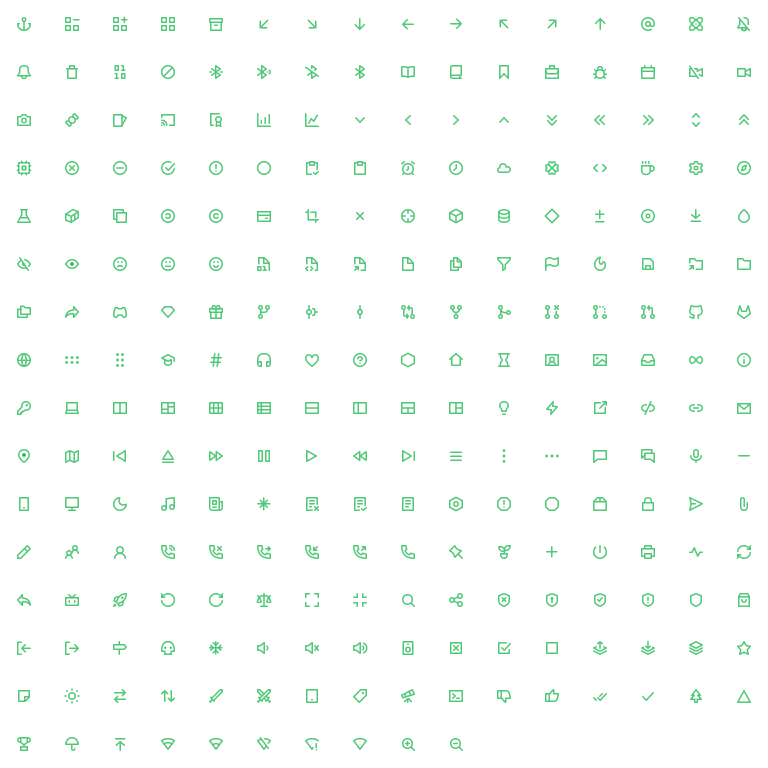

<div align="center">


# Charm Icons

[](https://github.com/jaynewey/charm-icons/actions)
[](https://github.com/jaynewey/charm-icons/blob/main/LICENSE)
[](https://www.npmjs.com/package/charm-icons)

</div>

> Charming Open Source vector icons.

`charm-icons` is a (growing!) set of MIT Licensed vector icons primarily designed for the 16x16 pixel grid. They are designed to be simple and flexible.

### Demo / Preview

A proper site with search, filter etc. is in the works.
For now, you can take a look at the icons on [CodePen](https://codepen.io/jaynewey/full/LYROoGJ) or below:

<div align="center">



</div>

## Contents

* [Inspiration / Motivation](#inspiration--motivation)
* [Installation](#installation)
  - [NPM (Recommended)](#npm-recommended)
  - [CDN](#cdn)
* [Usage](#usage)
  - [With ESModules (Recommended)](#with-esmodules-recommended)
  - [With CDN](#with-cdn)
  - [Using custom icons with the API](#using-custom-icons-with-the-api)
  - [API reference](#api-reference)
  - [Notes](#notes)
* [Contributing](#contributing)
* [Issues](#issues)
  - [Icon Requests](#icon-requests)

## Inspiration / Motivation

`charm-icons` takes inspiration from the following icon sets but tries to differ in key aspects.

* [Octicons](https://github.com/primer/octicons)
  - While Octicons have 16px variants designed for the 16x16 pixel grid, it does not use the `stroke-width` property, unlike `charm`.
    - Thus, `charm` allows for more customisation, and the icons tend to be smaller in file size.
* [Lucide / Feather](https://github.com/lucide-icons/lucide)
  - Lucide Icons are primarily designed for 24x24 pixel resolution whereas `charm` aims to look best at 16x16 pixel resolution.
    - For this reason, `charm` may work quite well alongside Lucide (be wary of design differences!).

`charm-icons` is also built to be fully treeshakable with ESModules.

## Installation

### NPM (Recommended)

You can install via npm:

```bash
npm install charm-icons
# or
yarn add charm-icons
```

### CDN

**Note:** The CDN version contains every icon - likely more than you will use. NPM installation is recommended so you can treeshake only the icons you need.

#### Testing / Experimentation

```html
<script src="https://unpkg.com/charm-icons@latest/dist/umd/charm.js"></script>
```

#### Minified

```html
<script src="https://unpkg.com/charm-icons@latest"></script>
```

## Usage

You may use the SVG files ([found here](/icons)) however you please. If you are using them in a javascript project, `charm-icons` provides a basic API for handling them.

Following are some examples of using the API to insert an icon into your webpage:

### With ESModules (Recommended)

Your html will look like this:

```html
<i data-charm="heart" class="my-class"></i>
<i data-charm="face-smile" class="my-class"></i>
<i data-charm="thumb-up" class="my-class"></i>
```

Your javascript will look like one of the following:

#### Treeshaking (Recommended)

```javascript
// Include the icons you need.
import { placeIcons, Heart, FaceSmile, ThumbUp } from 'charm-icons';

// Tell `placeIcons()` to replace them.
placeIcons({
  icons: {
    Heart,
    FaceSmile,
    ThumbUp,
  },
});
```

#### All icons

```javascript
// This will still bundle any unused icons.
import { placeIcons, icons } from 'charm-icons';

placeIcons({ icons: icons });
```

### With CDN

```html
<!DOCTYPE html>
<body>
  <i data-charm="flame" class="my-class"></i>

  <script src="https://unpkg.com/charm-icons@latest"></script>
  <script>
    charm.placeIcons({ icons: charm.icons });
  </script>
</body>
```

### Using custom icons with the API

_See [this codepen demo](https://codepen.io/jaynewey/pen/wvovOQX) for a working demo of this section._

You can use any icons you like with the API, provided the icon is an object with the following attributes:

| Attribute name | Type       | Description                                |
|----------------|------------|--------------------------------------------|
| `name`         | `string`   | The name of the icon in `kebab-case`       |
| `paths`        | `string`   | The svg content                            |
| `keywords`     | `[string]` | A list of relevant keywords (may be empty) |

For example, let's make our own `test` icon, a copy of `conical-flask` with a different name:

```html
<body>
  <div>
    <i data-charm="test"></i>
  </div>
</body>
```

```js
const Test = {
  name: 'test',
  paths: '<path d="m4.75 1.75h6.5m-6.5 8h6.5m-5.5-7.5v4.5l-4 7.5h12.5l-4-7.5v-4.5"/>',
  keywords: ['beaker', 'development', 'experimental', 'lab', 'science', 'study'],
};
```

You can then pass the new icon to `placeIcons()`:

```js
charm.placeIcons({ icons: {Test} });
```


### API reference

#### `charm.placeIcons({ icons = {}, attrs = {}, replaceAttr = 'data-charm' })`

Replaces all elements with the `replaceAttr` attribute with the respective icon.

##### Parameters

* `icons`
  - List of icons that you are using, e.g `{ AtSign, Tick }`
  - If you want to use all icons, then use `icons`

* `attrs`
  - Attributes to add to every icon replaced by `placeIcon` e.g `{ class: "my-class my-other-class"}`
* `replaceAttr`
  - `placeIcons` replaces all elements with the `replaceAttr` (by default `'data-charm'`) attribute with the icon specified, e.g `data-charm="at-sign"`.
    - **Note:** here you use `kebab-case` for the icon name (`at-sign` instead of `AtSign`)

---

#### `charm.toSvg(icon, attrs = {})`

Converts an icon object to an SVG string.

##### Parameters

* `icon`
  - Icon object to convert.
* `attrs`
  - (Optional) attributes to add to the SVG root.

---

#### `charm.toElement(icon, attrs = {})`

Converts an icon object to an SVG `HTMLElement`

##### Parameters

* `icon`
  - Icon object to convert.
* `attrs`
  - (Optional) attributes to add to the element.

---

#### `charm.replaceElement(element, icon, attrs = {}, replaceAttr = 'data-charm')`

Replaces a `HTMLElement` with an icon.

##### Parameters

* `element`
  - The `HTMLElement` to replace.
* `icon`
  - Icon to be transformed into a `HTMLElement` and placed.
* `attrs`
  - (Optional) attributes to add to the element.
* `replaceAttr`
  - Element attribute to be ignored - this will be `replaceAttr` when invoked by `charm.placeIcons()`.

---

#### `getAttrs(icon, attrs = {})`

Get the combined attributes of an icon and given attributes.

##### Parameters

* `icon`
  - An icon object. (`{name, paths, keywords}`)
* `attrs`
  - (Optional) additional attributes.

### Notes

* `charm` and `charm-<icon name>` classes are added to all icons by default. Use these classes how you please.

## Contributing

Contributions are warmly welcomed. If you are contributing icon designs, please read the [icon design guidelines](https://github.com/jaynewey/charm-icons/tree/main/docs/ICON_GUIDELINES.md).

## Issues

Please use the [GitHub issue tracker](https://github.com/jaynewey/charm-icons/issues) to track issues.

### Icon Requests

Please see the [icon request issue template](https://github.com/jaynewey/charm-icons/tree/main/.github/ISSUE_TEMPLATE) for submitting icon requests.
