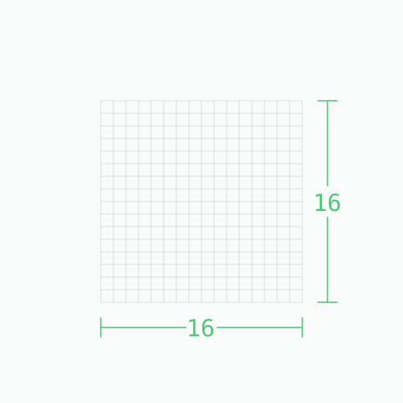
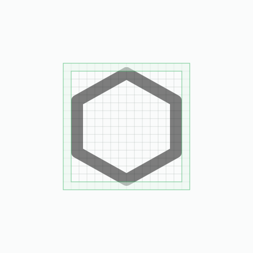
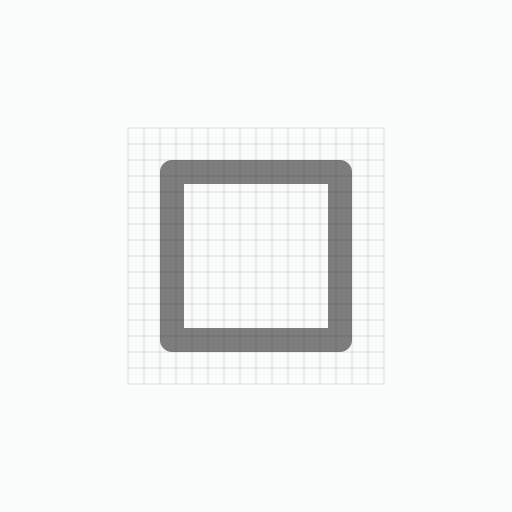
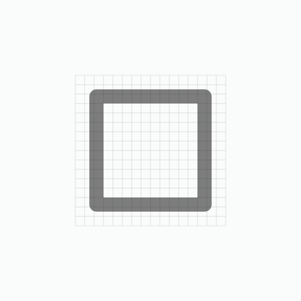
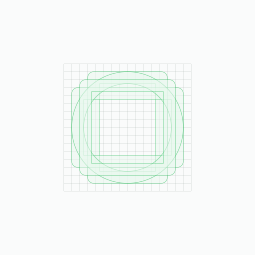

# Icon Guidelines

To keep `charm-icons` somewhat consistent, some guidelines are outlined. They are designed to be restrictive, but not _too_ restrictive to avoid hindering flexibility.

## Design

### Grid Size

Icons are designed on a 16x16 grid, where each grid square represents a pixel when the vector is rendered at 16x16 pixels:

<div align="center">



</div>

#### Padding

Leave a 1 pixel padding around the icon. This is so that icons with a larger `stroke-width` than 1.5 will not be cut off by the viewbox.

<div align="center">


</div>

Only if visually necessary, you may extend to at maximum a 0.5 pixel border.

<div align="center">



</div>

### `stroke-width`

All icons must be designed primarily with a `stroke-width` of 1.5 in mind. (However, users may adjust this).

### Caps and Joins

Use `round` linecaps and linejoins.

```
"stroke-linecap": "round",
"stroke-linejoin": "round"
```

<div align="center">


</div>

### Grid Alignment

Align the outer edges of shapes to the grid wherever possible.

|||
|---|---|
|Do |Don't|

### Keylines

For balance, circles are [overshot](https://en.wikipedia.org/wiki/Overshoot_(typography)) from squares to make them optically similar in proportion. Rectangles should be squished squares for balance.

This isn't a hard rule. For example if an icon has content within a square, the square may need to be larger to accommodate it. However, keep it in mind and use where applicable.

<div align="center">



</div>

## SVG Format

Do the following to keep the `.svg` file concise, clean and consistent with the rest of `charm-icons`:

### Default Attributes

The format of every icon will look like this:

```html
<svg xmlns="http://www.w3.org/2000/svg" version="1.1" viewBox="0 0 16 16" width="16" height="16" fill="none" stroke="currentColor" stroke-linecap="round" stroke-linejoin="round" stroke-width="1.5">
<!-- SVG Elements -->
</svg>
```

### Use `polygon`, `polyline` etc.

It's nice to use:

```
rect
circle
ellipse
line
polygon
polyline
```

...instead of paths where possible to improve readability of the SVG file. However, it is not absolutely necessary nor always applicable, especially in cases where it can massively bloat file size.

### Minify paths

Use [`SVGO`](https://github.com/svg/svgo), [`scour`](https://github.com/scour-project/scour) (done automatically on inkscape: `export > Optimized SVG`) or another suitable SVG minifier to minify paths.
